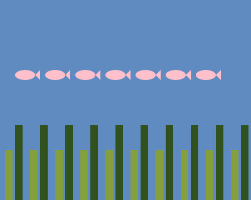

# 🐟 SVG Aquarium Generator 🐟

This program creates a simple SVG file of an aquarium with fish and seaweed 🌊. You can add up to **7 fish** with customizable colors, along with dark green and light green seaweed for a lively underwater scene! 🌿🐠

## 💻 How It Works

The program:
1. **Prompts** the user to enter the number of fish (up to 7).
2. **Asks** for a color for each fish 🎨 (e.g., "red", "blue").
3. **Draws** each fish with a body (ellipse) and a tail (polygon), positioning them across the aquarium.
4. **Adds** dark green and light green seaweed at the bottom for an added underwater effect 🌿.

The output is an SVG representation of an aquarium, including all user-defined fish and colors.

## 🛠️ Code Overview

- **Fish Drawing**: Each fish has an `ellipse` for the body and a `polygon` for the tail. The color is set based on user input.
- **Seaweed**: Two types of seaweed are drawn with `rectangles`:
  - **Dark Green Seaweed** 🌿: Taller, starting higher up.
  - **Light Green Seaweed** 🌱: Shorter, positioned lower, creating a sense of depth.
- **`std::cerr` for Input Prompts**: Keeps input prompts separate from SVG output.

## 📋 Usage

1. **Clone** this repository:
   ```bash
   git clone https://github.com/sevalkayikci/svg-aquarium-generator.git
   cd svg-aquarium-generator
   ```
2. **Compile** the program:
   ```bash
   g++ aquarium.cpp -o aquarium
   ```
3. **Run** the program and enter fish details:
   ```bash
   ./aquarium > aquarium.svg
   ```

   ### Example interaction:
   ```plaintext
   enter number of fish (maximum 7 fish): 7
   enter color for fish: pink
   enter color for fish: pink
   enter color for fish: pink
   enter color for fish: pink
   enter color for fish: pink
   enter color for fish: pink
   enter color for fish: pink
   ```

4. **Open `aquarium.svg`** in a browser or SVG viewer to see your custom aquarium! 🌊🐠

## ✨ Example SVG Output

Here’s an example of the aquarium with 7 pink fish:


